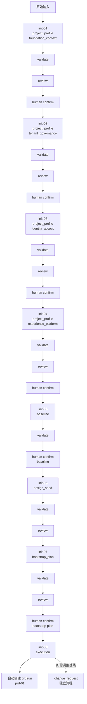
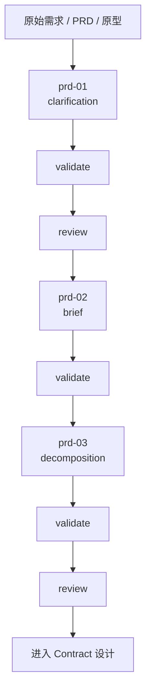

# Init / PRD 流程总览

这份文档用于测试时快速看清：

- 当前在哪条流程
- 正在执行第几步
- 下一步会依赖什么产物

## Init

## PRD

## 依赖原则

- 下一步 agent 默认优先消费“上一步正式通过的 YAML”，不是随手复制上一轮聊天记录
- `meta.source_paths` 用于主产物串联上游上下文
- `meta.subject_path` 用于 reviewer 明确指向当前被审对象
- `meta.step_id` 用于测试过程中的人工追踪
