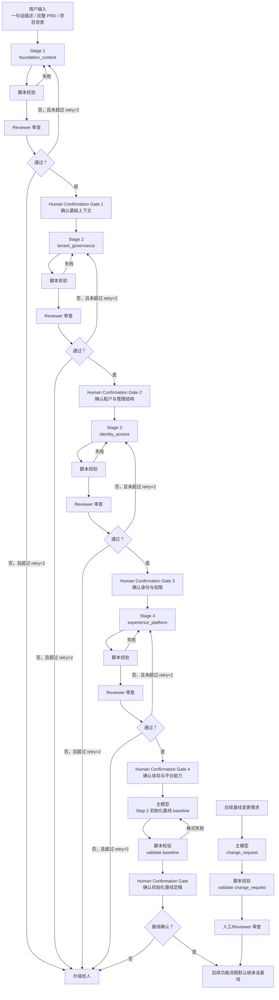

# 项目初始化流程指南

## 目标

这份文档用于回答两个问题：

1. 项目初始化流程解决什么问题
2. 拿到一个新项目时，应该按什么顺序建立系统基线

## 一图看懂

如果你测试时更关心“当前走到第几步”，推荐直接看：

- [STEP_NAMING_GUIDE.md](/Users/wangwenjie/project/archetype-admin-path/docs/init/STEP_NAMING_GUIDE.md)
- [WORKFLOW_FLOW_OVERVIEW.md](/Users/wangwenjie/project/archetype-admin-path/docs/WORKFLOW_FLOW_OVERVIEW.md)
- [WORKFLOW_PROGRESS_BOARD.md](/Users/wangwenjie/project/archetype-admin-path/docs/WORKFLOW_PROGRESS_BOARD.md)
- [RUNS_WORKSPACE_GUIDE.md](/Users/wangwenjie/project/archetype-admin-path/docs/RUNS_WORKSPACE_GUIDE.md)

## 这条流程和 PRD 流程的关系

`docs/init` 和 `docs/prd` 是并列关系：

- `docs/init`：处理系统级基座
- `docs/prd`：处理普通业务功能

后续普通功能 PRD 默认继承初始化基线。

如果新需求与初始化基线冲突，不应直接在功能 PRD 里偷偷修改，而应触发初始化变更流程。

## 当前流程版本

当前使用的是：

- 轻量双模型初始化版

特点是：

- 主模型负责生成项目画像和初始化基线
- 主 agent 先跑脚本校验格式
- reviewer 负责审查内容、推荐项和推进决策
- 初始化变更单独走 `change_request`

## 实际使用顺序

### 第一步：读取用户输入，建立项目画像

输入可以是：

- 一句话项目描述
- 一段项目背景
- 一份完整 PRD

这一步先抽系统级信息，不下钻具体页面细节。

`project_profile` 不再是一张平铺大表，而是一个会被多轮更新的阶段化画像。

关键变化是：

- 不是 AI 一次性生成 4 个阶段
- 而是每个阶段单独生成、单独审查、单独人工确认
- 当前阶段确认前，下一阶段不能开始

推荐按下面顺序推进：

1. `foundation_context`
2. `tenant_governance`
3. `identity_access`
4. `experience_platform`

如果用线性步骤编号来执行，推荐映射为：

1. `init-01` = `foundation_context`
2. `init-02` = `tenant_governance`
3. `init-03` = `identity_access`
4. `init-04` = `experience_platform`
5. `init-05` = `baseline`

先看：

- [rules/PROJECT_PROFILE_RULE.md](/Users/wangwenjie/project/archetype-admin-path/docs/init/rules/PROJECT_PROFILE_RULE.md)

然后初始化并填写：

- `ruby scripts/init/init_artifact.rb project_profile path/to/project_profile.yaml`
- `ruby scripts/init/init_artifact.rb --step-id init-01 project_profile runs/demo/init-01.project_profile.yaml`
- [templates/structured/project_profile.template.yaml](/Users/wangwenjie/project/archetype-admin-path/docs/init/templates/structured/project_profile.template.yaml)
- `ruby scripts/init/validate_artifact.rb project_profile path/to/project_profile.yaml`

填写时要注意：

- 先写 `project_profile` 摘要，再推进当前阶段
- 当前阶段写完整，后续阶段只保留固定题骨架和空白位，不提前填写正式结论
- 能做成选项题的问题，不要开放提问
- 对常规项优先给推荐默认值
- 只有当前阶段人工确认后，才把该阶段移入 `completed_stages`
- 确认结果应回填到对应阶段的 `confirmation`

### 第二步：Reviewer 审查项目画像

脚本通过后，再进入 reviewer：

- `ruby scripts/init/init_artifact.rb --step project_initialization review path/to/review.yaml`
- `ruby scripts/init/init_artifact.rb --step project_initialization --step-id init-01 review runs/demo/init-01.review.yaml`
- [templates/structured/review.template.yaml](/Users/wangwenjie/project/archetype-admin-path/docs/init/templates/structured/review.template.yaml)

这一轮重点看：

- 是否抓准了项目类型和适用地区
- 是否优先确认了最影响后续流程的当前阶段问题
- 是否把关键决策错误地下沉成默认值
- 是否明确下一阶段应该推进什么
- 是否把后续阶段不必要地展开成完整题库

reviewer 通过后，还不能直接开下一阶段，还必须先经过该阶段的人类确认。

### 第三步：生成初始化基线

4 个阶段都完成并经过人工确认后，生成统一基线：

- `ruby scripts/init/init_artifact.rb baseline path/to/baseline.yaml`
- `ruby scripts/init/init_artifact.rb --step-id init-05 baseline runs/demo/init-05.baseline.yaml`
- [templates/structured/baseline.template.yaml](/Users/wangwenjie/project/archetype-admin-path/docs/init/templates/structured/baseline.template.yaml)
- `ruby scripts/init/validate_artifact.rb baseline path/to/baseline.yaml`

这一步的目标是把系统级基座定成后续默认输入。

至少应覆盖：

- 项目画像摘要
- 地区和语言
- 登录方式
- 账号和权限体系
- 租户模型
- UI 主题基线
- 通用平台能力

同时建议为核心字段补齐来源追踪：

- 每个正式写入的 baseline 字段都能追到对应 stage
- 优先追到 `question_id` 或 `key_decision.topic`
- 这样后续做基线变更时，可以直接定位受影响来源

### 第四步：后续需要调整时，走初始化变更流程

如果后续出现：

- 从单租户改成多租户
- 从邮箱登录改成手机号登录
- 新增平台管理员 + 租户管理员两层体系
- UI 主题方向整体改版

则进入：

- `change_request`

而不是直接在普通 PRD 流程里改。

## 推荐的最小阅读顺序

1. [WORKFLOW_GUIDE.md](/Users/wangwenjie/project/archetype-admin-path/docs/init/WORKFLOW_GUIDE.md)
2. [STRUCTURED_OUTPUT_GUIDE.md](/Users/wangwenjie/project/archetype-admin-path/docs/init/STRUCTURED_OUTPUT_GUIDE.md)
3. [templates/structured/project_profile.template.yaml](/Users/wangwenjie/project/archetype-admin-path/docs/init/templates/structured/project_profile.template.yaml)
4. [templates/structured/review.template.yaml](/Users/wangwenjie/project/archetype-admin-path/docs/init/templates/structured/review.template.yaml)
5. [templates/structured/baseline.template.yaml](/Users/wangwenjie/project/archetype-admin-path/docs/init/templates/structured/baseline.template.yaml)
6. [templates/structured/change_request.template.yaml](/Users/wangwenjie/project/archetype-admin-path/docs/init/templates/structured/change_request.template.yaml)
