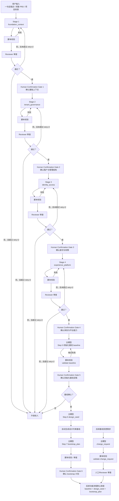

# 项目初始化流程指南

## 目标

这份文档用于回答两个问题：

1. 项目初始化流程解决什么问题
2. 拿到一个新项目时，应该按什么顺序建立系统基线

## 一图看懂

如果你测试时更关心“当前走到第几步”，推荐直接看：

- [STEP_NAMING_GUIDE.md](/Users/wangwenjie/project/archetype-admin-path/docs/init/STEP_NAMING_GUIDE.md)
- [WORKFLOW_FLOW_OVERVIEW.md](/Users/wangwenjie/project/archetype-admin-path/docs/WORKFLOW_FLOW_OVERVIEW.md)
- [WORKFLOW_PROGRESS_BOARD.md](/Users/wangwenjie/project/archetype-admin-path/docs/WORKFLOW_PROGRESS_BOARD.md)
- [RUNS_WORKSPACE_GUIDE.md](/Users/wangwenjie/project/archetype-admin-path/docs/RUNS_WORKSPACE_GUIDE.md)

## 这条流程和 PRD 流程的关系

`docs/init` 和 `docs/prd` 是并列关系：

- `docs/init`：处理系统级基座
- `docs/prd`：处理普通业务功能

后续普通功能 PRD 默认继承初始化基线。

如果新需求与初始化基线冲突，不应直接在功能 PRD 里偷偷修改，而应触发初始化变更流程。

## 当前流程版本

当前使用的是：

- 轻量双模型初始化版

特点是：

- 主模型负责生成项目画像和初始化基线
- 主 agent 先跑脚本校验格式
- reviewer 负责审查内容、推荐项和推进决策
- 初始化变更单独走 `change_request`

## 实际使用顺序

### 第一步：读取用户输入，建立项目画像

输入可以是：

- 一句话项目描述
- 一段项目背景
- 一份完整 PRD

这一步先抽系统级信息，不下钻具体页面细节。

`project_profile` 不再是一张平铺大表，而是一个会被多轮更新的阶段化画像。

关键变化是：

- 不是 AI 一次性生成 4 个阶段
- 而是每个阶段单独生成、单独审查、单独人工确认
- 当前阶段确认前，下一阶段不能开始

推荐按下面顺序推进：

1. `foundation_context`
2. `tenant_governance`
3. `identity_access`
4. `experience_platform`

如果用线性步骤编号来执行，推荐映射为：

1. `init-01` = `foundation_context`
2. `init-02` = `tenant_governance`
3. `init-03` = `identity_access`
4. `init-04` = `experience_platform`
5. `init-05` = `baseline`
6. `init-06` = `design_seed`
7. `init-07` = `bootstrap_plan`

先看：

- [rules/PROJECT_PROFILE_RULE.md](/Users/wangwenjie/project/archetype-admin-path/docs/init/rules/PROJECT_PROFILE_RULE.md)

然后初始化并填写：

- `ruby scripts/init/profile/init_project_profile_step.rb runs/demo init-01`
- [templates/structured/project_profile.template.yaml](/Users/wangwenjie/project/archetype-admin-path/docs/init/templates/structured/project_profile.template.yaml)
- `ruby scripts/init/validate_artifact.rb project_profile path/to/project_profile.yaml`

填写时要注意：

- 先写 `project_profile` 摘要，再推进当前阶段
- 当前阶段写完整，后续阶段只保留固定题骨架和空白位，不提前填写正式结论
- 能做成选项题的问题，不要开放提问
- 对常规项优先给推荐默认值
- 只有当前阶段人工确认后，才把该阶段移入 `completed_stages`
- 确认结果应回填到对应阶段的 `confirmation`

### 第二步：Reviewer 审查项目画像

脚本通过后，再进入 reviewer：

- `ruby scripts/init/profile/init_project_profile_review.rb runs/demo init-01`
- [templates/structured/review.template.yaml](/Users/wangwenjie/project/archetype-admin-path/docs/init/templates/structured/review.template.yaml)

这一轮重点看：

- 是否抓准了项目类型和适用地区
- 是否优先确认了最影响后续流程的当前阶段问题
- 是否把关键决策错误地下沉成默认值
- 是否明确下一阶段应该推进什么
- 是否把后续阶段不必要地展开成完整题库

reviewer 通过后，还不能直接开下一阶段，还必须先经过该阶段的人类确认。

### 第三步：生成初始化基线

4 个阶段都完成并经过人工确认后，生成统一基线：

- `ruby scripts/init/foundation/prepare_baseline.rb runs/demo`
- [templates/structured/baseline.template.yaml](/Users/wangwenjie/project/archetype-admin-path/docs/init/templates/structured/baseline.template.yaml)
- `ruby scripts/init/validate_artifact.rb baseline path/to/baseline.yaml`

这一步的目标是把系统级基座定成后续默认输入。

至少应覆盖：

- 项目画像摘要
- 地区和语言
- 登录方式
- 账号和权限体系
- 租户模型
- UI 风格方案与主题基线
- 通用平台能力

对于 `experience_platform` 阶段，推荐输出方式不是只问“深色还是浅色”，而是：

1. 先给适合当前系统的主推荐风格组合
2. 再给 2-4 个可选风格组合
3. 每个候选附带简短文字化预览，帮助用户判断大致界面效果
4. 用户如不满意，再自定义组合

`init-05 baseline` 完成后，仍需要人工通读并确认这份基线定稿结果，但这里不应再沿用 01-04 的问卷格式；只需要确认 baseline 是否可作为后续默认输入。

### 第四步：自动生成 design_seed

`init-06` 不再要求用户继续回答问卷，而是基于已确认的 baseline 自动生成一份“设计约束基线”。

- `ruby scripts/init/foundation/prepare_design_seed.rb runs/demo`
- [templates/structured/design_seed.template.yaml](/Users/wangwenjie/project/archetype-admin-path/docs/init/templates/structured/design_seed.template.yaml)
- `ruby scripts/init/validate_artifact.rb design_seed path/to/design_seed.yaml`

脚本通过后，再进入 reviewer。

这一步当前的执行口径是：

- 保留 reviewer
- 不单独停给人
- reviewer 通过后直接进入 `init-07`
- 但在 `init-07` 人工确认前，必须把 `design_seed` 渲染成 Markdown 给用户通读

这一步的目标不是写代码，而是把已经选定的风格方向收敛成后续默认继承的规则。

建议至少包含：

- style recipe 落地版
- theme strategy
- spacing / radius / shadow / typography / semantic color 基线
- app shell 结构原则
- 基础组件风格原则
- 禁止项

说明：

- 这一步的具体值不要求用户拍脑袋决定
- 具体参数应优先参考已选风格及 `UI/UX Pro Max` 一类风格参考
- `human` 负责选风格，`AI` 负责把风格收敛成具体约束
- 虽然 `init-06` 不单独停给人，但 reviewer 通过后进入 `init-07` 人工确认前，仍应把 `design_seed` 渲染成 Markdown，和 `bootstrap_plan` 一起给人通读

### 第五步：生成 bootstrap_plan

`init-07` 用于确定哪些内容属于“无需业务 PRD、但应该优先初始化”的项目底座计划。

- `ruby scripts/init/bootstrap/prepare_bootstrap_plan.rb runs/demo`
- [templates/structured/bootstrap_plan.template.yaml](/Users/wangwenjie/project/archetype-admin-path/docs/init/templates/structured/bootstrap_plan.template.yaml)
- `ruby scripts/init/validate_artifact.rb bootstrap_plan path/to/bootstrap_plan.yaml`

脚本通过后，再进入 reviewer。

建议覆盖：

- 第8步允许执行的纯工程初始化范围
- design_seed 沉淀出的长期项目规则文件
- 下一轮 PRD 直接可用的交接上下文
- reviewer 要检查的边界与禁区

其中项目规则文件建议固定落在：

- `docs/project/project-conventions.md`

生成方式建议固定为：

- 脚本负责模板骨架与结构化字段回填
- AI 负责按当前项目补强细节并做一次自审
- reviewer 负责检查是否真的覆盖 design_seed 的关键规则

其中 `prd_bootstrap_context` 的重点不是总结 init，也不是项目长期规则文件，而是给下一轮 PRD 提供一份基础 PRD 输入。至少应明确：

- 项目概况
- 登录 / 账号 / 租户 / 权限等基础前提
- 框架型组件基础与平台通用能力组件基础
- 下一轮 PRD 应先展开哪些基础模块
- 这些内容不包含任何具体业务功能前提

建议这部分也采用：

- 脚本先生成结构骨架
- AI 补强模块目标、组件边界、状态与变体细节
- reviewer 检查是否仍停留在基础 PRD 范围

这一步结尾应再次让人工确认，因为它决定后续初始化工程要先做哪些底座工作。

这里的人工确认重点不是继续答题，而是判断：

- 第8步是否被限定在纯工程初始化范围内
- project_conventions 是否真的适合写入项目内长期复用
- 下一轮 PRD 是否已经拿到足够的基础 PRD 输入
- 是否需要 reviewer 先拦一次，避免混入业务实现或接口细节

在进入这个人工确认关口前，还应额外生成：

- `rendered/init-07.project-conventions.md`
- `rendered/init-07.prd-bootstrap-context.md`
- `rendered/init-07.init-execution-scope.md`

这样用户在 `init-07` 就能一次确认长期项目规则、下一轮 PRD 输入和第8步到底会怎样落地，而不是等到执行前才第一次看到这些材料。

同时建议为核心字段补齐来源追踪：

- 每个正式写入的 baseline 字段都能追到对应 stage
- 优先追到 `question_id` 或 `key_decision.topic`
- 这样后续做基线变更时，可以直接定位受影响来源

### 第六步：执行 init-08

`init-08` 用于按 `Init Execution Scope` 执行项目初始化。

执行前的默认确认方式应固定包含：

- 请用户通读 `rendered/init-06.design_seed.md`
- 请用户通读 `rendered/init-07.bootstrap_plan.md`
- 请用户通读 `rendered/init-07.project-conventions.md`
- 请用户通读 `rendered/init-07.prd-bootstrap-context.md`
- 请用户通读 `rendered/init-07.init-execution-scope.md`
- `rendered/init-07.bootstrap_plan.md` 本身应作为索引页，直接包含“执行参数确认”段落，给出项目名称候选、目录 slug 候选和默认初始化位置
- 给出 3 个项目名称候选，默认推荐 `a`
- 给出 2 到 3 个目录名称候选，使用英文/slug 形式，默认推荐第一个
- 说明默认执行参数：
  - 初始化位置：当前工作区根目录下创建名为 `<目录名称>` 的目录，该目录本身就是项目根目录
  - git 处理：默认删除现有 `.git`
  - 用户如需修改，可直接回复新的目录、保留 git、或指定 remote-url

执行后应自动完成：

- 在 run 内先生成待落位的干净版 `rendered/init-08.project-conventions.md`
- 生成 run 内专用 `prompts/init-08-execution-prompt.md`
- 生成 run 内专用 `prompts/init-08-reviewer-prompt.md`
- 由新的执行代理或新上下文完成工程初始化命令和 AI 补强
- 执行代理把规则文档写入实际代码目录 `docs/project/project-conventions.md`
- 工程初始化完成后，再交给独立 reviewer 子 agent 或新上下文审查
- reviewer 通过后自动执行 `post_init_to_prd.rb`
- 创建新的 `prd` run
- 注入拆分后的干净 PRD 输入：
  - `raw/attachments/confirmed-foundation.md`
  - `raw/attachments/base-modules-prd.md`
- 预填新的 `raw/request.md`
- 生成新的 PRD 启动提示词，并明确引用规则文档
- `init-08` 只负责把已清洗的 `prd-bootstrap-context` 拆分并注入新的 PRD run，不再承担二次去味或兼容旧脏内容

推荐脚本链路：

- `ruby scripts/init/bootstrap/prepare_bootstrap_plan.rb runs/demo`
- 用户确认 `execution_scope`、项目名称和目录名称后，再执行：`ruby scripts/init/execution/prepare_execution.rb runs/demo --project-name <name> --project-dir-name <slug>`
- 上一步会基于已确认参数生成 `rendered/init-08.project-conventions.md`、`prompts/init-08-execution-prompt.md` 和 `prompts/init-08-reviewer-prompt.md`
- 不要继续复用当前长上下文；新开一个上下文后，把 `prompts/init-08-execution-prompt.md` 交给执行代理
- 执行代理在工程初始化完成后，把 `prompts/init-08-reviewer-prompt.md` 交给独立 reviewer
- reviewer 通过后，执行代理再执行 `ruby scripts/init/post_init_to_prd.rb path/to/bootstrap_plan.yaml --project-name <name>`

### 第七步：后续需要调整时，走初始化变更流程

如果后续出现：

- 从单租户改成多租户
- 从邮箱登录改成手机号登录
- 新增平台管理员 + 租户管理员两层体系
- UI 主题方向整体改版

则进入：

- `change_request`

而不是直接在普通 PRD 流程里改。

## 推荐的最小阅读顺序

1. [WORKFLOW_GUIDE.md](/Users/wangwenjie/project/archetype-admin-path/docs/init/WORKFLOW_GUIDE.md)
2. [STRUCTURED_OUTPUT_GUIDE.md](/Users/wangwenjie/project/archetype-admin-path/docs/init/STRUCTURED_OUTPUT_GUIDE.md)
3. [templates/structured/project_profile.template.yaml](/Users/wangwenjie/project/archetype-admin-path/docs/init/templates/structured/project_profile.template.yaml)
4. [templates/structured/review.template.yaml](/Users/wangwenjie/project/archetype-admin-path/docs/init/templates/structured/review.template.yaml)
5. [templates/structured/baseline.template.yaml](/Users/wangwenjie/project/archetype-admin-path/docs/init/templates/structured/baseline.template.yaml)
6. [templates/structured/design_seed.template.yaml](/Users/wangwenjie/project/archetype-admin-path/docs/init/templates/structured/design_seed.template.yaml)
7. [templates/structured/bootstrap_plan.template.yaml](/Users/wangwenjie/project/archetype-admin-path/docs/init/templates/structured/bootstrap_plan.template.yaml)
8. [scripts/init/execute_init_scope.rb](/Users/wangwenjie/project/archetype-admin-path/scripts/init/execute_init_scope.rb)
9. [templates/structured/change_request.template.yaml](/Users/wangwenjie/project/archetype-admin-path/docs/init/templates/structured/change_request.template.yaml)
