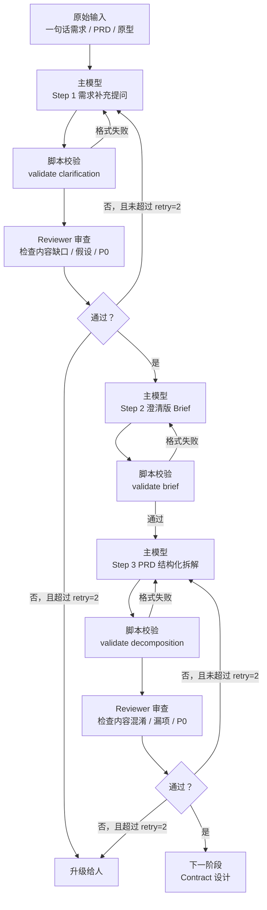

# PRD 拆解流程指南

## 目标

这份文档用于回答两个问题：

1. 当前 `docs/prd` 里的几份文档分别是干什么的
2. 实际拿到一个新需求时，应该按什么顺序使用

## 一图看懂

如果你测试时更关心“当前是第几步、下一步该接什么”，推荐直接看：

- [STEP_NAMING_GUIDE.md](/Users/wangwenjie/project/archetype-admin-path/docs/prd/STEP_NAMING_GUIDE.md)
- [WORKFLOW_FLOW_OVERVIEW.md](/Users/wangwenjie/project/archetype-admin-path/docs/WORKFLOW_FLOW_OVERVIEW.md)
- [WORKFLOW_PROGRESS_BOARD.md](/Users/wangwenjie/project/archetype-admin-path/docs/WORKFLOW_PROGRESS_BOARD.md)
- [RUNS_WORKSPACE_GUIDE.md](/Users/wangwenjie/project/archetype-admin-path/docs/RUNS_WORKSPACE_GUIDE.md)

## 当前流程版本

当前使用的是：

- 轻量双模型审查版

特点是：

- 主模型负责生成
- 主 agent 先跑脚本校验格式
- reviewer 负责挑错和把关
- 先不引入完整 debate
- 每个关口都有限定的最大 retry 次数

## Retry 规则

为防止模型来回磨洋工，当前所有关口统一采用：

- 最大 retry 次数：`2`

也就是：

- 初稿完成后先过脚本校验
- 脚本通过后才进入 reviewer
- reviewer 若要求返工，主模型最多返工 2 轮
- 每次返工后仍要先重新过脚本校验
- 超过 2 轮仍无法通过，必须升级给人处理

这条规则当前是硬限制，不建议放开。

## 文档分工

### 1. 规则文档

这类文档主要是“给 AI 看，也给人定规矩”。

- [rules/REQUIREMENT_CLARIFICATION_RULE.md](/Users/wangwenjie/project/archetype-admin-path/docs/prd/rules/REQUIREMENT_CLARIFICATION_RULE.md)
  - 用途：规定“需求补充提问”这一步怎么做
  - 适合什么时候看：开始补问前

- [rules/PRD_DECOMPOSITION_RULE.md](/Users/wangwenjie/project/archetype-admin-path/docs/prd/rules/PRD_DECOMPOSITION_RULE.md)
  - 用途：规定“PRD 结构化拆解”这一步怎么做
  - 适合什么时候看：开始做结构化拆解前

- [rules/REVIEWER_RULE.md](/Users/wangwenjie/project/archetype-admin-path/docs/prd/rules/REVIEWER_RULE.md)
  - 用途：规定 reviewer 只做审查，不做重写
  - 适合什么时候看：开始启用第二模型时

### 2. 模板文档

这类文档主要分成两层：

- 结构化 YAML 模板：主模型和 reviewer 直接填写
- 归档 Markdown 模板：仅保留在 archive 中做历史参考

当前主流程以 YAML 模板为准。

- [templates/structured/clarification.template.yaml](/Users/wangwenjie/project/archetype-admin-path/docs/prd/templates/structured/clarification.template.yaml)
  - 用途：输出需求补充提问产物

- [templates/structured/brief.template.yaml](/Users/wangwenjie/project/archetype-admin-path/docs/prd/templates/structured/brief.template.yaml)
  - 用途：输出澄清版 brief

- [templates/structured/decomposition.template.yaml](/Users/wangwenjie/project/archetype-admin-path/docs/prd/templates/structured/decomposition.template.yaml)
  - 用途：输出 PRD 结构化拆解结果

- [templates/structured/review.template.yaml](/Users/wangwenjie/project/archetype-admin-path/docs/prd/templates/structured/review.template.yaml)
  - 用途：输出 reviewer 审查结果

- [archive/legacy-flow/README.md](/Users/wangwenjie/project/archetype-admin-path/docs/prd/archive/legacy-flow/README.md)
  - 用途：查看旧版自由 Markdown 流程归档

### 3. Prompt 文档

这类文档主要是“直接拿去执行”。

- [prompts/MASTER_PROMPT.md](/Users/wangwenjie/project/archetype-admin-path/docs/prd/prompts/MASTER_PROMPT.md)
  - 用途：给主模型用

- [prompts/REVIEWER_PROMPT.md](/Users/wangwenjie/project/archetype-admin-path/docs/prd/prompts/REVIEWER_PROMPT.md)
  - 用途：给 reviewer 用

- [prompts/EXECUTION_CHECKLIST.md](/Users/wangwenjie/project/archetype-admin-path/docs/prd/prompts/EXECUTION_CHECKLIST.md)
  - 用途：跑流程时逐步对照

### 4. 参考资料

这类文档主要是“帮助我们理解方法，不直接作为执行模板”。

- [archive/reference/README.md](/Users/wangwenjie/project/archetype-admin-path/docs/prd/archive/reference/README.md)
- [archive/reference/Harness实战(PM极度舒适版).md](/Users/wangwenjie/project/archetype-admin-path/docs/prd/archive/reference/Harness实战(PM极度舒适版).md)
- 其它 `.notes.md`

这些适合在：

- 设计方法时参考
- 需要优化流程时参考

不适合在每次执行时都重新完整阅读。

### 5. 测试样例

这类文档主要是“给人和 AI 看一个实际例子”。

- [archive/samples/1.0/01-需求补充提问.md](/Users/wangwenjie/project/archetype-admin-path/docs/prd/archive/samples/1.0/01-需求补充提问.md)
- [archive/samples/1.0/02-澄清版brief.md](/Users/wangwenjie/project/archetype-admin-path/docs/prd/archive/samples/1.0/02-澄清版brief.md)
- [archive/samples/1.0/03-PRD结构化拆解.md](/Users/wangwenjie/project/archetype-admin-path/docs/prd/archive/samples/1.0/03-PRD结构化拆解.md)

这些适合在：

- 不确定模板怎么填时参考
- 想验证流程效果时参考

## 实际使用顺序

### 第一步：拿到原始输入

原始输入可能是：

- 一句话需求
- 一份详细 PRD
- 一份 PRD 加原型

这时不要直接做结构化拆解。

先看：

- [rules/REQUIREMENT_CLARIFICATION_RULE.md](/Users/wangwenjie/project/archetype-admin-path/docs/prd/rules/REQUIREMENT_CLARIFICATION_RULE.md)

然后初始化并让主模型直接填写 YAML：

- `ruby scripts/prd/init_artifact.rb clarification path/to/clarification.yaml`
- `ruby scripts/prd/init_artifact.rb --step-id prd-01 clarification runs/demo/prd-01.clarification.yaml`
- [templates/structured/clarification.template.yaml](/Users/wangwenjie/project/archetype-admin-path/docs/prd/templates/structured/clarification.template.yaml)

随后先做脚本门禁：

- `ruby scripts/prd/validate_artifact.rb clarification path/to/clarification.yaml`

脚本通过后，再让 reviewer 审查：

- `ruby scripts/prd/init_artifact.rb --step requirement_clarification review path/to/review.yaml`
- `ruby scripts/prd/init_artifact.rb --step requirement_clarification --step-id prd-01 review runs/demo/prd-01.review.yaml`
- [templates/structured/review.template.yaml](/Users/wangwenjie/project/archetype-admin-path/docs/prd/templates/structured/review.template.yaml)

产出物是：

- 补充提问清单
- 当前已知信息
- 当前缺口
- reviewer 审查意见

### 第二步：形成澄清版 brief

当补问阶段通过后，初始化并填写：

- `ruby scripts/prd/init_artifact.rb brief path/to/brief.yaml`
- `ruby scripts/prd/init_artifact.rb --step-id prd-02 brief runs/demo/prd-02.brief.yaml`
- [templates/structured/brief.template.yaml](/Users/wangwenjie/project/archetype-admin-path/docs/prd/templates/structured/brief.template.yaml)
- `ruby scripts/prd/validate_artifact.rb brief path/to/brief.yaml`

把结果压缩成一个中间文档。

填写时要注意：

- `meta.source_paths` 至少应包含上一阶段 `clarification` 产物
- 如果 `source_paths` 只指向原始输入而不指向 `clarification`，当前校验会直接拦下

这一步的目标是：

- 不再直接消费原始 PRD
- 后续统一消费这份 brief

### 第三步：做 PRD 结构化拆解

当 brief 足够稳定后，先看：

- [rules/PRD_DECOMPOSITION_RULE.md](/Users/wangwenjie/project/archetype-admin-path/docs/prd/rules/PRD_DECOMPOSITION_RULE.md)

再初始化并让主模型填写：

- `ruby scripts/prd/init_artifact.rb decomposition path/to/decomposition.yaml`
- `ruby scripts/prd/init_artifact.rb --step-id prd-03 decomposition runs/demo/prd-03.decomposition.yaml`
- [templates/structured/decomposition.template.yaml](/Users/wangwenjie/project/archetype-admin-path/docs/prd/templates/structured/decomposition.template.yaml)
- `ruby scripts/prd/validate_artifact.rb decomposition path/to/decomposition.yaml`

输出结构化结果。

填写时要注意：

- `meta.source_paths` 至少应包含上一阶段 `brief` 产物
- `modules / pages / roles / resources / flows / states` 现在是对象数组，不再是自由字符串列表

然后再让 reviewer 审查一轮。

reviewer 审查时建议先初始化：

- `ruby scripts/prd/init_artifact.rb --step prd_decomposition review path/to/review.yaml`
- `ruby scripts/prd/init_artifact.rb --step prd_decomposition --step-id prd-03 review runs/demo/prd-03.review.yaml`
- `meta.subject_path` 必须指向当前被审的 `decomposition` YAML

这一步的产出应包含：

- 模块
- 页面
- 角色
- 资源
- 流程
- 状态
- 权限与租户观察
- 待确认项

### 第四步：判断是否进入下一步

如果结构化拆解结果里还有大量 P0 问题，就不要进入 contract。

此时应该：

- 回到补问阶段继续补信息
- 或在超过 retry 上限后升级给人

如果只是 P1 / P2，或者是“条件性可以”，就可以准备进入下一阶段：

- contract 设计

## 对你来说最实用的用法

如果你是“人来驱动流程”，最简单的做法是：

1. 先把原始需求放进一个目录
2. 用脚本初始化当前步骤的 YAML 骨架
3. 让主模型直接填写 `clarification` YAML
4. 先跑脚本校验，不通过就先修 YAML
5. 让 reviewer 输出 `review` YAML 做第一轮内容审查
6. 你回答关键问题
7. 让主模型填写 `brief` YAML 并先过脚本校验
8. 你确认 brief
9. 再让主模型填写 `decomposition` YAML 并先过脚本校验
10. 让 reviewer 输出第二轮 `review` YAML
11. 需要人工阅读时，再渲染成 Markdown

也就是说：

- 规则文档：像操作说明书
- 模板文档：像输入输出格式
- 测试样例：像参考答案

## 推荐的最小阅读顺序

如果你每次都想最快进入状态，只看这几份就够：

1. [WORKFLOW_GUIDE.md](/Users/wangwenjie/project/archetype-admin-path/docs/prd/WORKFLOW_GUIDE.md)
2. [STRUCTURED_OUTPUT_GUIDE.md](/Users/wangwenjie/project/archetype-admin-path/docs/prd/STRUCTURED_OUTPUT_GUIDE.md)
3. [templates/structured/clarification.template.yaml](/Users/wangwenjie/project/archetype-admin-path/docs/prd/templates/structured/clarification.template.yaml)
4. [templates/structured/review.template.yaml](/Users/wangwenjie/project/archetype-admin-path/docs/prd/templates/structured/review.template.yaml)
5. [templates/structured/brief.template.yaml](/Users/wangwenjie/project/archetype-admin-path/docs/prd/templates/structured/brief.template.yaml)
6. [templates/structured/decomposition.template.yaml](/Users/wangwenjie/project/archetype-admin-path/docs/prd/templates/structured/decomposition.template.yaml)
