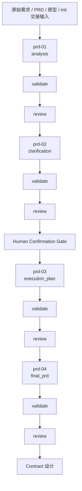

# PRD 2.0 流程指南

## 目标

这份文档用于说明：

1. 当前正式 PRD 流程分哪几步
2. 每一步负责什么
3. 实际执行时该按什么顺序推进

执行前建议先读：

1. [steps/README.md](/Users/wangwenjie/project/archetype-admin-path/docs/prd/steps/README.md)
2. [prompts/README.md](/Users/wangwenjie/project/archetype-admin-path/docs/prd/prompts/README.md)
3. [reviewer/README.md](/Users/wangwenjie/project/archetype-admin-path/docs/prd/reviewer/README.md)
4. PRD workflow manifest：
   [scripts/prd/workflow_manifest.rb](/Users/wangwenjie/project/archetype-admin-path/scripts/prd/workflow_manifest.rb)
5. PRD continue_run：
   [scripts/prd/continue_run.rb](/Users/wangwenjie/project/archetype-admin-path/scripts/prd/continue_run.rb)
6. PRD finalize_step：
   [scripts/prd/finalize_step.rb](/Users/wangwenjie/project/archetype-admin-path/scripts/prd/finalize_step.rb)
7. PRD review_complete：
   [scripts/prd/review_complete.rb](/Users/wangwenjie/project/archetype-admin-path/scripts/prd/review_complete.rb)
8. PRD confirm_clarification：
   [scripts/prd/confirm_clarification.rb](/Users/wangwenjie/project/archetype-admin-path/scripts/prd/confirm_clarification.rb)

`continue_run` 约定：

- `--mode artifact`：初始化或重建某一步主 YAML
- `--mode review`：初始化该步 reviewer YAML 和 reviewer 材料快照
- `--mode render`：渲染当前步骤 Markdown；只应用在已填写且已通过校验的 artifact 上

`finalize_step` 约定：

- 面向“当前主 YAML 已填写完成”的场景
- 会顺序执行 `validate -> init_review_context -> render`
- 执行完成后会把进度板切到当前步骤的 `review` 状态

`review_complete` 约定：

- 面向“review YAML 已由独立 reviewer 填写完成”的场景
- 会校验 `review.yaml` 和被审主产物
- 根据 reviewer 结论把步骤写成 `done / confirmed / blocked`

`confirm_clarification` 约定：

- 面向 `clarification` reviewer 通过、进入 Human Gate 之后的场景
- 会回写 `human_confirmation.confirmed / summary / confirmed_by / confirmed_at`
- 会根据 `required` 级 `confirmation_items` 是否都已有对应 `clarified_decisions.item_id`，决定是否允许进入 `execution_plan`

## 当前正式流程

## 步骤职责

### Step 1：analysis

目标：

- 先分析输入
- 先拆分范围、模块、页面、对象、流程
- 识别阻塞缺口和澄清候选

这一步不做的事：

- 不直接进入 Human Gate
- 不直接产出最终 PRD
- 不把未确认的业务事实写死

### Step 2：clarification

目标：

- 只处理真正不确定、且会影响下游设计的问题
- 统一使用 `confirmation_items`
- 显式经过人工确认

这一步的核心原则：

- 对话层只暴露真正待决策的问题
- 能选项化的，不写成开放题
- 已足够稳定的信息不重复追问
- 所有确认题都使用稳定编号，便于用户按编号回复

### Step 3：execution_plan

目标：

- 明确推进顺序
- 明确依赖关系
- 明确哪些模块、contract、页面要先做

这一步不是最终 PRD，而是下游执行排序器。

### Step 4：final_prd

目标：

- 汇总本轮范围、角色、资源、页面、流程、状态和约束
- 输出可直接交给 `contract` 设计的最终输入索引，并拆成多个 batch

进入这一步前，默认应已经完成：

- analysis
- clarification
- Human Confirmation Gate
- execution_plan

## 实际执行顺序

### 第一步：生成 analysis

输入：

- 原始需求
- init 继承上下文
- 项目规则文档
- 其它真实附件

执行：

- `ruby scripts/prd/init_artifact.rb --step-id prd-01 analysis runs/demo/prd-01.analysis.yaml`
- `ruby scripts/prd/validate_artifact.rb analysis runs/demo/prd-01.analysis.yaml`
- `ruby scripts/prd/init_artifact.rb --step prd_analysis --step-id prd-01 review runs/demo/prd-01.review.yaml`

### 第二步：生成 clarification

输入：

- 已通过 review 的 `analysis`

执行：

- `ruby scripts/prd/init_artifact.rb --step-id prd-02 clarification runs/demo/prd-02.clarification.yaml`
- `ruby scripts/prd/validate_artifact.rb clarification runs/demo/prd-02.clarification.yaml`
- `ruby scripts/prd/init_artifact.rb --step prd_clarification --step-id prd-02 review runs/demo/prd-02.review.yaml`

然后：

- 执行 Human Confirmation Gate

### 第三步：生成 execution_plan

输入：

- 已确认的 `clarification`

执行：

- `ruby scripts/prd/init_artifact.rb --step-id prd-03 execution_plan runs/demo/prd-03.execution_plan.yaml`
- `ruby scripts/prd/validate_artifact.rb execution_plan runs/demo/prd-03.execution_plan.yaml`
- `ruby scripts/prd/init_artifact.rb --step prd_execution_plan --step-id prd-03 review runs/demo/prd-03.review.yaml`

### 第四步：生成 final_prd

输入：

- 已通过的 `execution_plan`
- 已确认的 `clarification`

执行：

- `ruby scripts/prd/init_artifact.rb --step-id prd-04 final_prd runs/demo/prd-04.final_prd.yaml`
- `ruby scripts/prd/validate_artifact.rb final_prd runs/demo/prd-04.final_prd.yaml`
- `ruby scripts/prd/init_artifact.rb --step final_prd_ready --step-id prd-04 review runs/demo/prd-04.review.yaml`

### 第五步：进入 contract

只有当 `final_prd.decision.allow_contract_design=true` 时，才进入 `contract`。
进入时应按 `final_prd.contract_execution.recommended_batch_order` 逐个选择 `ready_batches` 中的 batch，而不是把整份 final_prd 一次性喂给 contract。

## 关键门禁

### reviewer 独立性

- 每个 review 关口都必须保留 reviewer
- reviewer 必须由独立 reviewer 子 agent 或独立新上下文执行
- 主 agent 不得在同一个上下文里自写主产物再自写 reviewer 结论
- 主 agent 只能准备 reviewer 输入、读取 reviewer 输出并据此返工

### retry

- 每个关口最大 retry：`2`

### Human Confirmation Gate

- `clarification` 默认必须显式人工确认
- reviewer 通过后，流程应停在 Human Confirmation Gate，而不是直接推进到 `prd-03`
- 未确认前，不允许进入 `execution_plan`

### 阻塞条件

- `analysis.risk_analysis.blocking_gaps.p0` 不为空，不允许进入 `clarification`
- `clarification` 中存在尚未收口的 `required` 级确认项，不允许进入 `execution_plan`
- `final_prd.blocking_questions.p0` 不为空，不允许进入 `contract`
